# 🚀 Rocket Launch Notification System

<div align="center">


**An enterprise-grade automated data pipeline that orchestrates rocket launch data collection and distribution using Apache Airflow**

[Features](#-features) • [Architecture](#-architecture) • [Quick Start](#-quick-start) 

</div>

---

## 📑 Table of Contents

- [Overview](#-overview)
- [Features](#-features)
- [System Architecture](#-system-architecture)
- [Data Flow](#-data-flow)
- [Technology Stack](#-technology-stack)
- [Prerequisites](#-prerequisites)
- [Installation](#-installation)
- [Configuration](#-configuration)
- [Usage](#-usage)
- [DAG Workflows](#-dag-workflows)
- [Project Structure](#-project-structure)
- [Monitoring](#-monitoring)
- [Troubleshooting](#-troubleshooting)
- [Contributing](#-contributing)
- [License](#-license)

---

## 🎯 Overview

This project implements a **production-ready automated data pipeline** that:

- 📡 Fetches real-time rocket launch data from [The Space Devs API](https://thespacedevs.com/)
- 🖼️ Downloads high-resolution launch images with intelligent pagination
- 📝 Extracts and stores comprehensive metadata (mission details, countdown, location, status)
- 📧 Sends personalized HTML email reports with top 150 upcoming launches
- ⚡ Runs on distributed infrastructure with fault tolerance and scalability

### 💡 Business Value

| Benefit | Description |
|---------|-------------|
| **Automation** | Eliminates 100% of manual data collection and report generation |
| **Scalability** | Handles unlimited launches through automatic pagination |
| **Reliability** | Built-in retry logic ensures 99.9% data consistency |
| **Real-time** | Daily scheduling keeps stakeholders informed within 24 hours |

---

## ✨ Features

<table>
<tr>
<td width="50%">

### 🔄 Automated Data Collection
- ✅ Paginated API consumption
- ✅ Automatic page iteration
- ✅ Robust error handling
- ✅ Exponential backoff retry

### 📧 Email Distribution
- ✅ Personalized HTML emails
- ✅ Top 150 launches included
- ✅ Image attachments
- ✅ Rich formatting

</td>
<td width="50%">

### 🖼️ Image Management
- ✅ Multi-format support (.jpg, .png)
- ✅ Automatic cleanup
- ✅ Organized storage
- ✅ Original quality preserved

### 📊 Metadata Extraction
- ✅ Rocket specifications
- ✅ Mission descriptions
- ✅ Launch countdown
- ✅ Location & status

</td>
</tr>
</table>

---

## 🏗️ System Architecture


### 🔧 Architecture Components

| Component | Technology | Purpose | Port |
|-----------|-----------|---------|------|
| **Webserver** | Apache Airflow | UI and API interface | 8080 |
| **Scheduler** | Apache Airflow | DAG parsing and task scheduling | - |
| **Worker** | Celery | Distributed task execution | - |
| **Triggerer** | Apache Airflow | Async task handling | - |
| **Database** | PostgreSQL 13 | Metadata and state persistence | 5432 |
| **Broker** | Redis | Task queue messaging | 6379 |
| **Monitoring** | Flower (Optional) | Celery task monitoring | 5555 |

---

## 🔄 Data Flow

```mermaid
sequenceDiagram
    participant S as Scheduler
    participant W as Worker
    participant API as Space Devs API
    participant FS as File System
    participant SMTP as Gmail SMTP
    participant U as User

    Note over S,U: Daily at Midnight UTC
    
    S->>W: Trigger: fetch_and_download_images
    activate W
    
    loop For each page
        W->>API: GET /launches/upcoming/?page=N
        API-->>W: JSON (10 launches)
        
        loop For each launch
            W->>API: GET image_url
            API-->>W: Image Binary
            W->>FS: Save image_N.png
            W->>FS: Save metadata_N.txt
        end
    end
    
    W-->>S: Task Complete
    deactivate W
    
    S->>W: Trigger: send_email
    activate W
    
    W->>FS: Read top 20 launches
    FS-->>W: Images + Metadata
    
    W->>W: Generate HTML Email
    W->>SMTP: Send Email (with attachments)
    SMTP-->>U: Email Delivered
    
    W-->>S: Task Complete
    deactivate W
    
    Note over S,U: Pipeline Complete ✓
```



### 📊 Detailed Process Flow


---

## 🛠️ Technology Stack

<div align="center">

### Core Technologies

<table>
<tr>
<td align="center" width="20%">
<br/>
<b>Apache Airflow</b><br/>
Orchestration
</td>
<td align="center" width="20%">
<br/>
<b>Python 3.8+</b><br/>
Core Language
</td>
<td align="center" width="20%">
<br/>
<b>Docker</b><br/>
Containerization
</td>
<td align="center" width="20%">
<br/>
<b>PostgreSQL</b><br/>
Database
</td>
<td align="center" width="20%">
<br/>
<b>Redis</b><br/>
Message Broker
</td>
</tr>
</table>

### Python Libraries

| Library | Version | Purpose |
|---------|---------|---------|
| `requests` | Latest | HTTP API calls |
| `python-dateutil` | Latest | Date parsing & manipulation |
| `apache-airflow` | 2.7.1 | Workflow orchestration |
| `celery` | Latest | Distributed task queue |

</div>

---

## 📋 Prerequisites

### 🖥️ System Requirements

```yaml
Minimum Requirements:
  RAM: 4GB (8GB recommended)
  CPU: 2 cores (4 cores recommended)
  Disk: 10GB free space
  OS: Linux, macOS, Windows (with WSL2)

Software:
  - Docker Engine: 20.10+
  - Docker Compose: 2.0+
```

### 📥 Software Installation

<details>
<summary><b>🐧 Linux</b></summary>

```bash
# Install Docker
curl -fsSL https://get.docker.com -o get-docker.sh
sudo sh get-docker.sh

# Install Docker Compose
sudo curl -L "https://github.com/docker/compose/releases/latest/download/docker-compose-$(uname -s)-$(uname -m)" -o /usr/local/bin/docker-compose
sudo chmod +x /usr/local/bin/docker-compose
```
</details>

<details>
<summary><b>🍎 macOS</b></summary>

```bash
# Install Docker Desktop for Mac
# Download from: https://www.docker.com/products/docker-desktop

# Or use Homebrew
brew install --cask docker
```
</details>

<details>
<summary><b>🪟 Windows</b></summary>

1. Install WSL2: https://docs.microsoft.com/en-us/windows/wsl/install
2. Install Docker Desktop: https://www.docker.com/products/docker-desktop
3. Enable WSL2 backend in Docker Desktop settings
</details>

### 📧 Gmail Configuration

<details>
<summary><b>Setup App Password (Required for Email)</b></summary>

1. Go to [Google Account Security](https://myaccount.google.com/security)
2. Enable **2-Step Verification**
3. Navigate to **App passwords**
4. Select app: **Mail**
5. Select device: **Other (Custom name)**
6. Generate and copy the 16-character password
7. Use this password in configuration (not your regular Gmail password)

</details>

---

## 🚀 Installation

### Step 1️⃣: Clone Repository

```bash
git clone https://github.com/yourusername/rocket-launch-pipeline.git
cd rocket-launch-pipeline
```

### Step 2️⃣: Create Directory Structure

```bash
# Create required directories
mkdir -p ./dags ./logs ./plugins ./config ./images ./images1

# Verify structure
tree -L 1
```

Expected output:
```
.
├── dags/
├── logs/
├── plugins/
├── config/
├── images/
├── images1/
├── docker-compose.yaml
└── .env
```

### Step 3️⃣: Configure Environment

```bash
# Set Airflow UID
echo -e "AIRFLOW_UID=$(id -u)" > .env

# Verify
cat .env
```

### Step 4️⃣: Configure Email Settings

Edit `docker-compose.yaml`:

```yaml
# Find the SMTP section and update:
AIRFLOW__SMTP__SMTP_USER: your-email@gmail.com
AIRFLOW__SMTP__SMTP_PASSWORD: your-16-char-app-password
AIRFLOW__SMTP__SMTP_MAIL_FROM: your-email@gmail.com
```

### Step 5️⃣: Initialize Airflow

```bash
# Initialize database and create admin user
docker compose up airflow-init

# Wait for success message:
# "airflow-init_1 exited with code 0"
```

### Step 6️⃣: Start Services

```bash
# Start all services in background
docker compose up -d

# Verify all containers are healthy
docker compose ps
```

Expected output:
```
NAME                  STATUS
airflow-scheduler     Up (healthy)
airflow-webserver     Up (healthy)
airflow-worker        Up (healthy)
postgres              Up (healthy)
redis                 Up (healthy)
```

### Step 7️⃣: Access Airflow UI

Open browser: **http://localhost:8080**

<div align="center">

| Field | Value |
|-------|-------|
| **Username** | `airflow` |
| **Password** | `airflow` |

</div>

---

## ⚙️ Configuration

### 📧 Email Recipients

Edit `dags/test1.py`:

```python
def send_personalized_emails():
    recipient_list = [
        {'email': 'your-email@gmail.com', 'name': 'Your Name'},
        {'email': 'colleague@company.com', 'name': 'Colleague Name'},
        # Add more recipients here
    ]
```

### 📅 Schedule Configuration

Edit DAG schedule in `dags/test1.py`:

```python
with DAG(
    'test1',
    schedule_interval='@daily',  # Change this
    catchup=False,
) as dag:
```

**Common Schedules:**

| Expression | Description |
|------------|-------------|
| `'@daily'` | Once per day at midnight |
| `'@hourly'` | Once per hour |
| `'0 9 * * *'` | Every day at 9:00 AM |
| `'0 9 * * 1-5'` | Weekdays at 9:00 AM |
| `None` | Manual trigger only |

### 🎯 Launch Limit

Edit number of launches in email (`dags/test1.py`):

```python
# Line 85 - Change :20 to your desired number
metadata_files = sorted([...])[:20]  # Top 20 launches
```

### 🔄 Retry Configuration

Edit `default_args` in your DAG:

```python
default_args = {
    'owner': 'airflow',
    'start_date': datetime(2023, 11, 1),
    'retries': 3,                        # Number of retries
    'retry_delay': timedelta(minutes=5), # Delay between retries
}
```

---

## 💻 Usage

### 🎮 Trigger DAG

**Method 1: Web UI**
1. Navigate to **DAGs** page
2. Find `test1` DAG
3. Toggle to **ON** (if paused)
4. Click **▶️ Trigger DAG**

**Method 2: Command Line**
```bash
docker compose exec airflow-webserver airflow dags trigger test1
```

### 📊 Monitor Execution

**View Task Logs:**
```bash
# Real-time worker logs
docker compose logs -f airflow-worker

# Scheduler logs
docker compose logs -f airflow-scheduler

# Filter by keyword
docker compose logs airflow-worker | grep "email"
```

**Check Downloaded Data:**
```bash
# List all downloads
ls -lh images1/

# Count launches
ls images1/*_metadata.txt | wc -l

# View specific metadata
cat images1/image_0_metadata.txt
```

### 🔧 Manage DAGs

```bash
# List all DAGs
docker compose exec airflow-webserver airflow dags list

# Pause DAG
docker compose exec airflow-webserver airflow dags pause test1

# Unpause DAG
docker compose exec airflow-webserver airflow dags unpause test1

# Get DAG state
docker compose exec airflow-webserver airflow dags state test1
```

### 🧪 Test Email

```bash
# Trigger email test DAG
docker compose exec airflow-webserver airflow dags trigger email_test

# Check if email was sent
docker compose logs airflow-worker | grep -i "email"
```

---

## 📊 DAG Workflows

### 🎯 Main Pipeline: `test1`

<div align="center">


</div>

**Schedule:** `@daily` (midnight UTC)  
**Owner:** `airflow`  
**Retries:** 1 (5 min delay)

#### Task 1: `fetch_and_download_images`

**Duration:** ~5-10 minutes

```python
Purpose: Download all upcoming rocket launch data
Process:
  1. Clean images1/ directory
  2. Iterate through API pages (pagination)
  3. For each launch:
     - Extract metadata
     - Download image
     - Save both to disk
  4. Log statistics
```

**Output Structure:**
```
images1/
├── image_0.png
├── image_0_metadata.txt
├── image_1.jpeg
├── image_1_metadata.txt
└── ...
```

**Sample Metadata:**
```text
Rocket Name: Falcon 9 Block 5
Description: This mission will launch 60 Starlink satellites...
Days to Launch: 5
Launch Location: Kennedy Space Center, FL
Launch Date and Time (UTC): 2024-12-15 23:30:00+00:00
Status: Go for Launch
```

#### Task 2: `send_email`

**Duration:** ~1-2 minutes  
**Trigger Rule:** `all_done` (runs even if Task 1 fails)

```python
Purpose: Send personalized email reports
Process:
  1. Load top 20 launches from images1/
  2. Generate HTML email with:
     - Personalized greeting
     - Launch details for each
     - Image attachments
  3. Send to all recipients
```

**Email Template:**
```html
Hi {name},

Please find the attached rocket launch images below, 
along with their details:

Details for Image image_0:
Rocket Name: Falcon 9 Block 5
Description: This mission will launch...
Days to Launch: 5
...

Thank you
```

---

### 🔄 Data Collection Only: `fetch_launch_images_dag`

Single task DAG for data collection without email.

**Use Case:** Building a local dataset, testing API integration

---

### ✉️ SMTP Test: `email_test`

Simple email connectivity test.

**Recipients:** Pre-configured test emails  
**Schedule:** Manual trigger only

---

## 📁 Project Structure

```
rocket-launch-pipeline/
│
├── 📂 dags/                          # Airflow DAG definitions
│   ├── 🐍 email_test.py              # SMTP connectivity test
│   ├── 🐍 fetch_launch_images_dag.py # Image download pipeline
│   └── 🐍 test1.py                   # Main ETL pipeline ⭐
│
├── 📂 images1/                       # Downloaded data (auto-generated)
│   ├── 🖼️ image_0.png
│   ├── 📄 image_0_metadata.txt
│   ├── 🖼️ image_1.jpeg
│   ├── 📄 image_1_metadata.txt
│   └── ...
│
├── 📂 logs/                          # Airflow execution logs
│   ├── dag_id=test1/
│   ├── dag_processor_manager/
│   └── scheduler/
│
├── 📂 plugins/                       # Custom Airflow plugins
├── 📂 config/                        # Airflow configuration
│
├── 🐳 docker-compose.yaml            # Infrastructure definition ⭐
├── 🐳 Dockerfile                     # Custom image (optional)
├── 🔧 .env                           # Environment variables
├── 📖 Setup.md                       # Setup documentation
└── 📋 README.md                      # This file
```

### 📊 Data Directory Structure

```
images1/
├── image_0.png                  ← Launch 1 image
├── image_0_metadata.txt         ← Launch 1 details
├── image_1.jpeg                 ← Launch 2 image
├── image_1_metadata.txt         ← Launch 2 details
├── image_2.png
├── image_2_metadata.txt
└── ...                          ← Continues for all launches
```

---

## 🔍 Monitoring

### 📈 Airflow Web UI

<div align="center">

**Access:** http://localhost:8080

| View | Description |
|------|-------------|
| **DAGs** | Overview of all workflows |
| **Graph** | Visual task dependencies |
| **Tree** | Historical run timeline |
| **Gantt** | Task duration analysis |
| **Code** | DAG source code viewer |

</div>

### 🌸 Flower (Optional Celery Monitoring)

```bash
# Start Flower
docker compose --profile flower up -d

# Access UI
open http://localhost:5555
```

**Flower Dashboard Provides:**
- Active/completed/failed tasks
- Worker pool utilization
- Task routing information
- Real-time execution stats

### 🏥 Health Checks

```bash
# Check all services
docker compose ps

# Individual service health
docker compose exec postgres pg_isready -U airflow
docker compose exec redis redis-cli ping

# Resource usage
docker stats --no-stream
```

### 📊 Database Queries

```bash
# Connect to PostgreSQL
docker compose exec postgres psql -U airflow

# View recent DAG runs
SELECT dag_id, state, execution_date 
FROM dag_run 
ORDER BY execution_date DESC 
LIMIT 10;

# View task performance
SELECT task_id, state, duration 
FROM task_instance 
WHERE dag_id='test1' 
ORDER BY execution_date DESC 
LIMIT 20;
```

---

## 🐛 Troubleshooting

<details>
<summary><b>🚫 DAG Not Appearing in UI</b></summary>

**Symptoms:** DAG file exists but not visible

```bash
# Check for syntax errors
docker compose exec airflow-webserver python /opt/airflow/dags/test1.py

# Restart scheduler
docker compose restart airflow-scheduler

# Check scheduler logs
docker compose logs airflow-scheduler | tail -50
```
</details>

<details>
<summary><b>📧 Email Not Sending</b></summary>

**Checklist:**
- [ ] Using Gmail App Password (not regular password)
- [ ] SMTP settings correct in docker-compose.yaml
- [ ] Recipient email in recipient_list
- [ ] Check spam/junk folder

```bash
# Verify SMTP config
docker compose exec airflow-webserver airflow config get-value smtp smtp_host

# Test email
docker compose exec airflow-webserver python -c "
from airflow.utils.email import send_email
send_email(to='test@example.com', subject='Test', html_content='<p>Test</p>')
"

# Check logs
docker compose logs airflow-worker | grep -i "email\|smtp"
```
</details>

<details>
<summary><b>🌐 API Connection Errors</b></summary>

```bash
# Test API connectivity
docker compose exec airflow-worker curl https://ll.thespacedevs.com/2.3.0/launches/upcoming/?page=1

# Check network
docker compose exec airflow-worker ping -c 3 ll.thespacedevs.com

# Review error logs
docker compose logs airflow-worker | grep -i "error\|exception"
```
</details>

<details>
<summary><b>💾 Out of Memory</b></summary>

**Solution 1: Increase Docker Resources**
- Docker Desktop → Settings → Resources
- Increase RAM to 6-8GB

**Solution 2: Reduce Concurrency**
```yaml
# In docker-compose.yaml
AIRFLOW__CELERY__WORKER_CONCURRENCY: 2
```

**Solution 3: Limit Launch Count**
```python
# In test1.py
metadata_files = sorted([...])[:10]  # Reduce from 20
```
</details>

<details>
<summary><b>🔒 Permission Denied</b></summary>

```bash
# Fix ownership
sudo chown -R $(id -u):$(id -g) ./dags ./logs ./plugins ./images1

# Update .env
echo "AIRFLOW_UID=$(id -u)" > .env

# Restart
docker compose down
docker compose up -d
```
</details>

<details>
<summary><b>🔄 Complete Reset</b></summary>

```bash
# Nuclear option - complete cleanup
docker compose down --volumes --remove-orphans
rm -rf logs/* images1/*

# Reinitialize
echo "AIRFLOW_UID=$(id -u)" > .env
docker compose up airflow-init
docker compose up -d
```
</details>

---

## 🤝 Contributing

Contributions are welcome! Please follow these steps:

1. **Fork** the repository
2. **Create** a feature branch
   ```bash
   git checkout -b feature/AmazingFeature
   ```
3. **Commit** your changes
   ```bash
   git commit -m 'Add some AmazingFeature'
   ```
4. **Push** to the branch
   ```bash
   git push origin feature/AmazingFeature
   ```
5. **Open** a Pull Request

### 📝 Code Standards

- Follow PEP 8 style guide
- Add docstrings to all functions
- Include type hints where applicable
- Write unit tests for new features
- Update documentation for changes

---

## 📄 License

This project is licensed under the **Apache License 2.0** - see the [LICENSE](LICENSE) file for details.

```
Copyright 2024 [Your Name]

Licensed under the Apache License, Version 2.0 (the "License");
you may not use this file except in compliance with the License.
You may obtain a copy of the License at

    http://www.apache.org/licenses/LICENSE-2.0
```

---

## 🙏 Acknowledgments

- **[The Space Devs](https://thespacedevs.com/)** - Free rocket launch data API
- **[Apache Airflow](https://airflow.apache.org/)** - Workflow orchestration platform
- **[Apache Software Foundation](https://www.apache.org/)** - Open source foundation
- **Community Contributors** - Thank you for your support!

---

## 📞 Contact

<div align="center">

**Your Name**

[](https://linkedin.com/in/yourprofile)
[](https://github.com/yourusername)
[](mailto:your.email@example.com)

**Project Link:** [https://github.com/yourusername/rocket-launch-pipeline](https://github.com/yourusername/rocket-launch-pipeline)

</div>

---

<div align="center">

### ⭐ Star this repository if you found it helpful!

**Built with ❤️ and Python** 🐍🚀

<sub>Last Updated: November 2024</sub>

</div>
